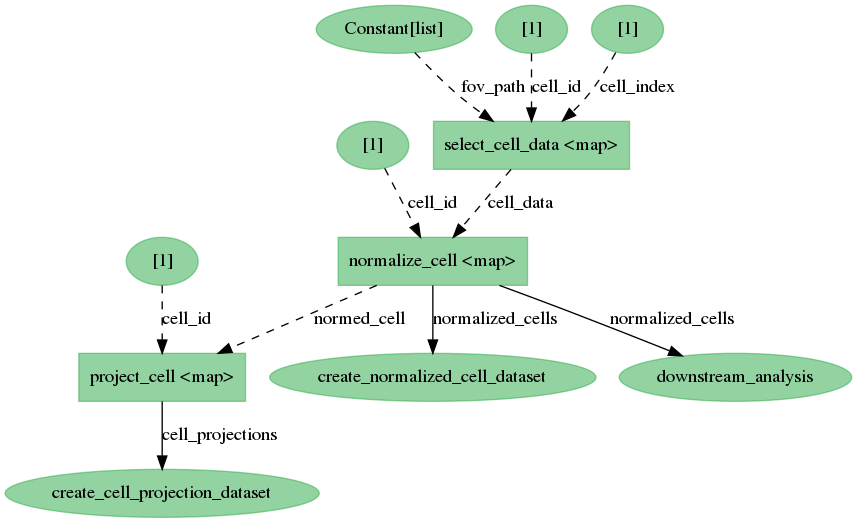

# Distributed Ecosystem Tools and Planning
Planned tools for making pipeline development and data reproduction easier

## Goals

The goal of these tools is to allow the scientists to not focus on data storage or
parallel code distribution.

> "Users, developers, scientests, etc. should be able to run the same pipeline on their
> laptop with local or remote data, or on a distributed cluster with local or remote
> data* and the products of the pipeline should be tied to the code and be 'publish
> ready.'"

-- Some scientist probably (it was [Rory](https://github.com/donovanr))

_* depending on the distributed cluster configuration, data must be local or remote but
usually cannot be both_

### Bullet Points

* iterative development should be simple
* sharing data should be easy (internally or externally)
* data is linked to the code that produced it
* data organization is (partially) managed for the user
* scaling from laptop to cluster should be a non-issue

## Psuedo-code
The following psuedo-code will show the effect of these tools on a common workflow for
many scientists and engineers in the institute. The workflow in general form can be
seen as:

1. selecting data you are interested in from an image
2. normalizing that data
3. storing projects or other representations of each selected datum
4. downstream analysis of normalized data as a different thread in the DAG
5. multiple processes to create collections / manifests of results (datasets)

As a DAG this pseudo-code looks like:



_The `[1]` representations are lists of `1` added as parameters to the function to map
across. In an actual example these would be much larger datasets. See below for more
discussion._

The following is Python psuedo-code for the above description:
```python
from aicsimageio import AICSImage, types
import dask.array as da
import pandas as pd
from prefect import Flow, task

# A repo that currently doesn't exist
from databacked import (
    # Developer chooses which dataset level result they want
    LocalDatasetResult, QuiltDatasetResult, FMSDatasetResult,
    # Developer chooses which single item level result they want
    # LocalResult and S3Result are just routers to base prefect objects
    LocalResult, S3Result, FMSResult,
    # Various serializers for common data types we work with
    ArrayToOmeTiff, ArrayToDefaultWriter
)

###############################################################################


@task
def select_cell_data(fov_path: types.FSSpecLike, cell_index: int) -> da.Array:
    """
    Loads the image from any FSSpec like path and returns just the CZYX cell data.
    """
    img = AICSImage(fov_path)
    # ...
    return cell_data


@task(
    result=LocalResult(
        dir="local_staging/normalized_cells/",
        serializer=ArrayToOmeTiff(dimensions="CZYX", channel_names=["a", "b", "..."]),
    ),
    target=lambda **kwargs: "{}.ome.tiff".format(kwargs.get("cell_id")),
)
def normalize_cell(cell_id: int, cell_data: da.Array) -> da.Array:
    """
    Normalizes the array provided. Returns a dask array.

    The serializer object knows how to receive a dask array and return the bytes for an
    OME-TIFF.

    The result object knows to take the bytes and store them at some location for
    check-pointing / persistence.
    """
    # ...
    return normed_cell


@task(
    result=QuiltDatasetResult(
        name="aics/my-project/normalized-cells",
        readme="/path/to/file",
        filepath_columns=["normalized_cell_path"],
        metadata_columns=["cell_id", "cell_index"],
    )
)
def create_normalized_cell_dataset(**dataset_metadata: Any) -> pd.DataFrame:
    """
    Create or formalize some dataset as a dataframe.

    This is basically the original "datastep" framework as a task.
    I.E.:
        store a manifest during you step
        -> validate and upload it to some storage system after

    See actk for an example of well formed datastep repo.
    https://github.com/AllenCellModeling/actk

    Unlike original datastep, you do not need to save the dataframe to a csv / parquet
    file. The "DatasetResult" handler will deal with serialization.
    """
    # ... create a dataset manifest of the cell projections
    return dataset


@task(
    result=LocalResult(
        dir="local_staging/normalized_cells/",
        serializer=ArrayToDefaultWriter,
    ),
    target=lambda **kwargs: "{}.png".format(kwargs.get("cell_id")),
)
def project_cell(cell_id: int, normed_cell: da.Array) -> da.Array:
    """
    Max projects the array provided. Returns a dask array.

    The serializer object knows how to receive a dask array and return the bytes for a
    PNG.

    The result object knows to take the bytes and store them at some location for
    check-pointing / persistence.
    """
    # ... do some projection
    return projection


@task(
    result=QuiltDatasetResult(
        name="aics/my-project/single-cell-projections",
        readme="/path/to/file",
        filepath_columns=["cell_projection_path"],
        metadata_columns=["cell_id", "cell_index"],
    )
)
def create_cell_projection_dataset(**dataset_metadata: Any) -> pd.DataFrame:
    """
    Create or formalize some dataset as a dataframe.

    This is basically the original "datastep" framework as a task.
    I.E.:
        store a manifest during you step
        -> validate and upload it to some storage system after

    See actk for an example of well formed datastep repo.
    https://github.com/AllenCellModeling/actk

    Unlike original datastep, you do not need to save the dataframe to a csv / parquet
    file. The "DatasetResult" handler will deal with serialization.
    """
    # ... create a dataset manifest of the cell projections
    return dataset


@task
def downstream_analysis(normalized_cells: List[da.Array]) -> Any:
    """
    Some downstream analysis to simply show the point that this is a true DAG.

    You could attach a result object to this as well if you wanted checkpointing or
    persistence.
    """
    # ... analysis code
    return research_object

###############################################################################

# assume we have some dataset as a dataframe
# dataset = pd....

with Flow("example_workflow") as flow:
    selected_cells = select_cell_data.map(
        dataset.fov_path,
        dataset.cell_index,
    )

    normalized_cells = normalize_cell.map(
        dataset.cell_id,
        selected_cells,
    )

    normalized_cell_dataset = create_normalized_cell_dataset(
        dataset.cell_id,
        dataset.cell_index,
        normalized_cells,
        # some other metadata
    )

    cell_projections = project_cell.map(
        dataset.cell_id,
        normalized_cells,
    )

    cell_proj_dataset = create_cell_projection_dataset(
        dataset.cell_id,
        dataset.cell_index,
        cell_projections,
        # some other metadata
    )

    downstream_analysis(normalized_cells)

flow.run()
```

### End Result of Pseudo-code

With current psuedo-code this results in:
1. Scientist doesn't have to care about file IO due to serializers
2. Results are _**checkpointed**_ at: `local_staging/` from current working directory
3. To move from local to remote they can find-replace `LocalResult` w/ `S3Result`*

_* I believe S3Result needs to be prefixed with s3://bucket-header, but still minimal
changes to move from local to remote_

#### Checkpointing

...

## Technology Choices

1. [AICSImageIO](#aicsimageio)
2. [Dask](#dask)
3. [Prefect](#prefect)


### AICSImageIO

...

### Dask

...

### Prefect

...


## The Last-Mile Library

"databacked" -- or whatever you want to name it.

1. "DatasetResult" Handlers
2. "ArrayTo*" Serializers

### DatasetResult Handlers

...

### ArrayTo Serializers

...
